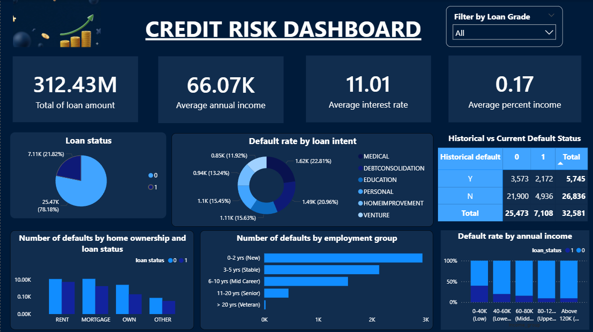

# Credit Risk Analysis

## 📌 Project Overview
This project focuses on credit risk analysis and loan default prediction using Python and Power BI.
An end-to-end machine learning workflow was developed to analyze borrower behavior, identify key risk factors, and build predictive models for loan default classification.

The project combines exploratory data analysis, feature engineering, feature selection, machine learning optimization, and business intelligence visualization to support credit risk management and decision-making.

---

# 🛠️ Tech Stack
* **Python** (Pandas, NumPy, Scikit-learn, XGBoost, Matplotlib, Seaborn, imbalanced-learn, Scikit-Optimize)
  * Data preprocessing
  * Feature selection
  * Machine learning modeling
  * Hyperparameter optimization
  * Model evaluation

* **Power BI**
  * Interactive dashboard development
  * Business insights visualization
  * Credit risk analysis

---

# 🔑 Project Workflow
## 1️⃣ Exploratory Data Analysis (EDA)
* Checked missing values and data distributions.
* Analyzed statistical metrics of numerical variables.
* Visualized distributions using:
  * Histograms
  * KDE plots
  * Boxplots
---

## 2️⃣ Data Preprocessing
* Handled missing values:
  * Mean imputation for `loan_int_rate`
  * Median imputation for `person_emp_length`
* Encoded categorical variables using `LabelEncoder`.
* Split the dataset into training and testing sets using a **70:30 ratio**.
* Performed Spearman correlation analysis on the training set.
* Used boxplots to validate correlations between selected features and the target variable.

---

## 3️⃣ Feature Selection
* Applied correlation-based feature selection using Spearman correlation for Logistic Regression, SVM, and MLP to identify the most relevant features associated with the target variable.
* Applied Pelican Optimization Algorithm (POA) for XGBoost to select the optimal subset of features while reducing feature redundancy and improving model performance.

---

## 4️⃣ Machine Learning Modeling
### Models Implemented
* Logistic Regression
* Support Vector Machine (SVM)
* Multi-Layer Perceptron (MLP)
* XGBoost

### Data Scaling & Imbalance Handling
For Logistic Regression, SVM, and MLP:
* Applied `StandardScaler` for feature scaling.
* Applied `SMOTEENN` (Synthetic Minority Oversampling Technique combined with Edited Nearest Neighbors) within machine learning pipelines to handle class imbalance.

### Hyperparameter Optimization to maximize "F1-score"
* **RandomizedSearchCV**
  * Logistic Regression
  * SVM

* **Bayesian Optimization**
  * XGBoost
  * MLP
 
---

## 5️⃣ Model Evaluation
Models were evaluated using:
* Accuracy
* Precision
* Recall
* F1-score

### Performance Comparison
| Model               | Accuracy | Precision | Recall | F1-score |
| ------------------- | -------- | --------- | ------ | -------- |
| XGBoost             | 0.93     | 0.94      | 0.93   | 0.93     |
| MLP                 | 0.86     | 0.87      | 0.86   | 0.86     |
| SVM                 | 0.85     | 0.86      | 0.85   | 0.85     |
| Logistic Regression | 0.78     | 0.83      | 0.78   | 0.79     |

=> XGBoost achieved the best overall performance across all evaluation metrics.
---

# 📊 Power BI Dashboard & Business Insights
Power BI was used to build an interactive dashboard for credit risk analysis and business insight generation.
Additional boxplot visualizations from Python were combined with dashboard analysis to validate relationships between selected features and loan default behavior.

## 🔍 Key Insights
* Customers with a high `loan_percent_income` are more likely to default.
* Customers with higher annual income (`person_income`) generally have lower default risk.
* Borrowers with `loan_intent = medical` show the highest default tendency.
* Customers with `home_ownership = rent` have a higher probability of default.
* Borrowers with shorter employment length (`person_emp_length`) are more likely to default.

---

# 🚀 How to Run
1. Clone this repository.
2. Install the required Python libraries.
3. Run the notebooks for:
   * Data preprocessing
   * Feature selection
   * Model training
   * Model evaluation
4. Open the Power BI dashboard file to explore business insights interactively.

---

# 📌 Future Improvements
* Deploy the best-performing model as a real-time prediction API.
* Experiment with deep learning architectures and ensemble techniques.

---

# ✨ Conclusion
This project demonstrates the integration of machine learning and business intelligence techniques to develop an effective credit risk analysis solution.
The workflow combines Data preprocessing, Feature selection, Machine learning optimization and Interactive visualization
to support better loan default prediction and credit risk management.
